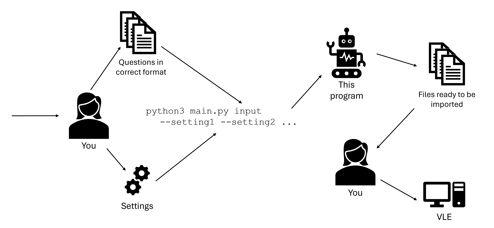

### This program facilitates the creation of quiz questions for Moodle and Learn Ultra.
It accompanies my UG5 project *[Quiz Whiz: A Command Line Tool for Creating Quiz Questions](https://drive.google.com/file/d/1B3-ldxnwUfDzB_Ken34NgD3khB7nmDiM/view?usp=sharing)*.



# Installation
Users new to command line programs are recommended to follow the [complete installation instructions](https://github.com/lewisforbes/Quiz-Whiz/wiki/Detailed-Installation).

Advanced users can follow this summary:
1. Ensure [Python3](https://www.python.org/) and [Pip](https://pypi.org/project/pip/) are installed.
2. `git clone https://github.com/lewisforbes/Quiz-Whiz`
3. Run `python3 main.py` to install dependancies.
4. If you see `All installation requirements met.` the program is ready to be used!

# Usage
The [example usage walkthrough](https://github.com/lewisforbes/Quiz-Whiz/wiki/Walkthrough) is the best way to learn how to use Quiz Whiz.

Full documentation is in [the wiki](https://github.com/lewisforbes/Quiz-Whiz/wiki).

# Just browsing?
For those simply curious of the program's capabilities, here's an overview.
At its simplist, the program is run through the command line as follows:

`python3 main.py InputFilepath --OutputType`

Where `--OutputType` is either `--learn` or `--moodle`, and `InputFilepath` is the filepath to an input file of the correct format.

An example input file might look something like:

```
# What colour is the sky at night?

- Pink
- ^Black
- Green

# Alan Turing was a famous pianist.

- False
```

Which creates the following questions on Learn:


