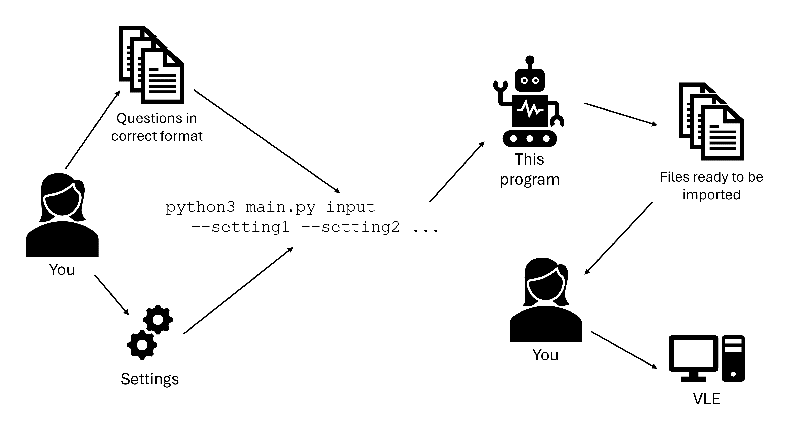
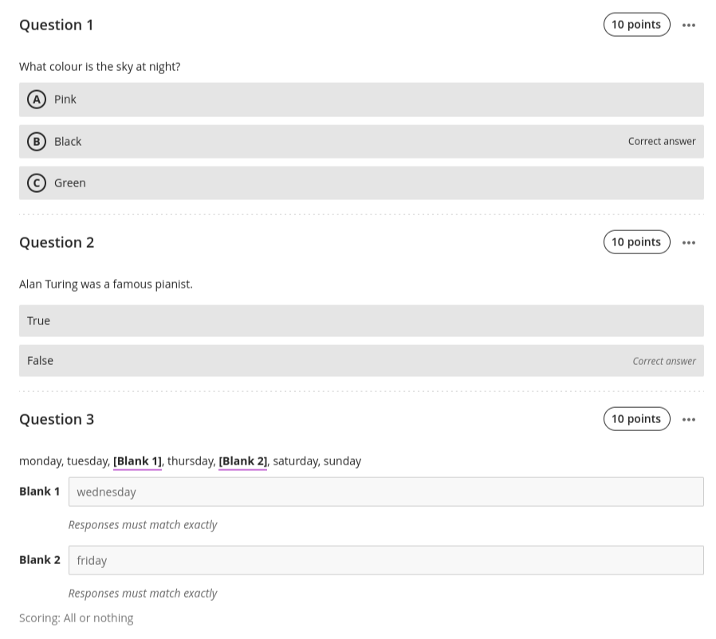

### This program facilitates the creation of quiz questions for Moodle and Learn Ultra.



# Installation
Users new to command line programs are recommended to follow the [complete installation instructions](docs/installation.md).

Advanced users can follow this summary:
1. Ensure [Python3](https://www.python.org/) and [Pip](https://pypi.org/project/pip/) are installed.
2. [Download this repo](https://github.com/lewisforbes/Quiz-Whiz/archive/refs/heads/main.zip) and unzip the files.
3. Run `python3 main.py` to install dependancies.
4. If you see `All installation requirements met.` the program is ready to be used!

# Usage
Users new to command line programs are recommended to complete the short [example usage walkthrough](docs/run_through.md).

## Full Usage
- [Question formatting](docs/basic_formatting.md)
- [Advanced formatting (including properties)](docs/advanced_formatting.md)
- [All `--settings`](docs/complete_usage.md)

# Just browsing?
For those simply curious of the program's capabilities, here's an over
At its simplist, the program is run through the command line as follows:

`python3 main.py InputFilepath --OutputType`

Where `--OutputType` is either `--learn` or `--moodle`, and `InputFilepath` is the filepath to an input file of the correct format.

An example input file might look something like:

```
# What colour is the sky at night?

- Pink
- ^Black
- Green

# Alan Turing was a famous pianist.

- False
```

Which creates the following questions on Learn:



